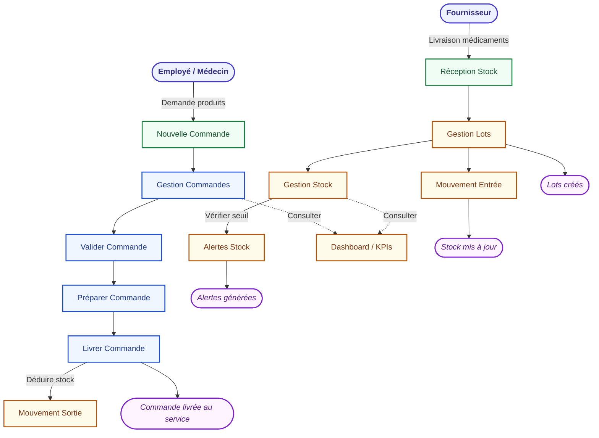
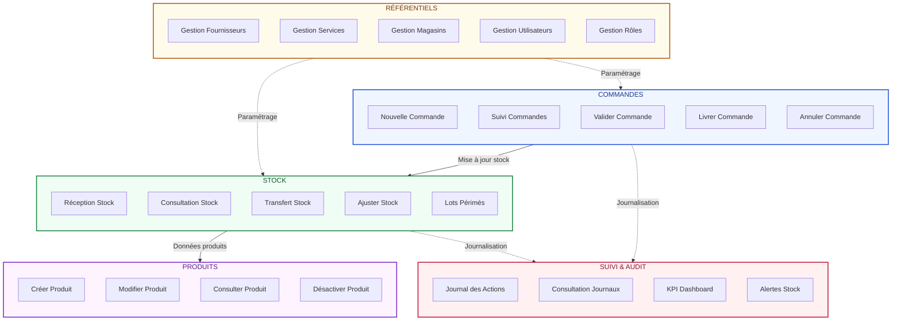

# MCT — Modèle Conceptuel des Traitements
## Système de Gestion Pharmaceutique (GDS)

---

## Flux Principal des Traitements

---

## Diagramme des Opérations par Domaine

---

## Sources de Données

| # | Entité | Type | Description |
|---|--------|------|-------------|
| 1 | **Produit** | Entité | Médicaments et produits pharmaceutiques |
| 2 | **Lot** | Entité | Lots / batchs de médicaments |
| 3 | **Mouvement** | Entité | Mouvements de stock (entrée / sortie) |
| 4 | **Commande** | Entité | Commandes des services |
| 5 | **LigneCommande** | Entité | Lignes de commande |
| 6 | **Fournisseur** | Entité | Fournisseurs de médicaments |
| 7 | **Service** | Entité | Services hospitaliers |
| 8 | **Magasin** | Entité | Magasins / entrepôts |
| 9 | **Utilisateur** | Entité | Utilisateurs du système |
| 10 | **Role** | Entité | Rôles et permissions |
| 11 | **Journal** | Entité | Journal d'audit |

---

## Règles de Gestion

| Code | Règle |
|------|-------|
| **RG01** | Une commande doit être validée avant livraison |
| **RG02** | Le stock est déduit automatiquement lors de la livraison |
| **RG03** | Les lots sont sélectionnés par ordre de péremption (FIFO) |
| **RG04** | Les mouvements de stock sont automatiquement journalisés |
| **RG05** | Les alertes sont générées pour stock sous seuil |
| **RG06** | Seuls les pharmaciens peuvent valider les commandes |
| **RG07** | Les lots périmés doivent être identifiés et traités |
