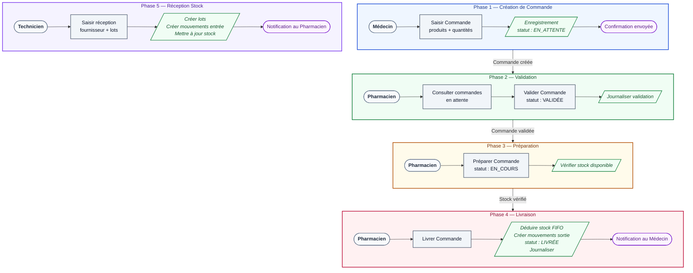
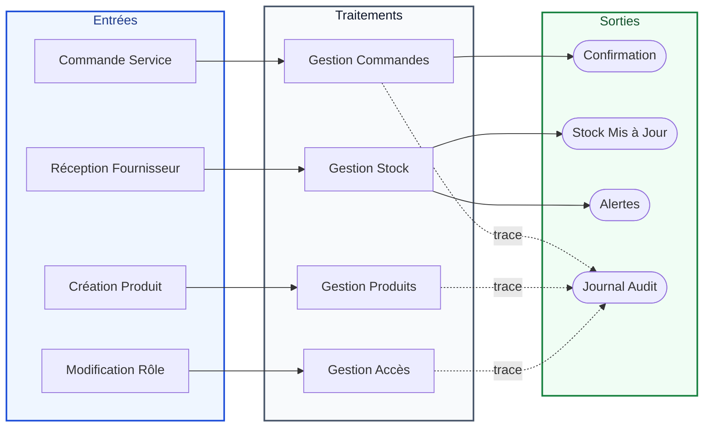

# MOT — Modèle Organisationnel des Traitements
## Système de Gestion Pharmaceutique (GDS)

---

## Affectation Postes — Fonctions

```mermaid
flowchart LR
    %% ── POSTES DE TRAVAIL ────────────────────────────────────────
    subgraph PHARMACIE["  PHARMACIE  "]
        direction TB
        P1(["Pharmacien"])
        P2(["Technicien Pharmacie"])
    end

    subgraph SERVICES["  SERVICES MÉDICAUX  "]
        direction TB
        S1(["Médecin"])
        S2(["Responsable Service"])
    end

    subgraph ADMIN_GRP["  ADMINISTRATION  "]
        direction TB
        A1(["Administrateur"])
    end

    %% ── FONCTIONS ────────────────────────────────────────────────
    subgraph STOCK_FN["  Gestion Stock  "]
        direction TB
        F1["Réceptionner Stock"]
        F2["Contrôler Lots"]
        F3["Gérer Mouvements"]
        F4["Générer Alertes"]
    end

    subgraph CMD_FN["  Gestion Commandes  "]
        direction TB
        F5["Créer Commande"]
        F6["Valider Commande"]
        F7["Préparer Commande"]
        F8["Livrer Commande"]
    end

    subgraph PROD_FN["  Gestion Produits  "]
        direction TB
        F9["Consulter Produits"]
        F10["Créer / Modifier Produit"]
        F11["Désactiver Produit"]
    end

    subgraph REF_FN["  Gestion Référentiels  "]
        direction TB
        F12["Gestion Fournisseurs"]
        F13["Gestion Services"]
        F14["Gestion Utilisateurs"]
        F15["Gestion Rôles"]
    end

    subgraph SUIVI_FN["  Suivi & Audit  "]
        direction TB
        F16["Consulter Dashboard"]
        F17["Consulter Journaux"]
        F18["Consulter Stock"]
    end

    %% ── PHARMACIEN ───────────────────────────────────────────────
    P1 --> F1 & F2 & F6 & F7 & F8
    P1 --> F10 & F11 & F12
    P1 --> F16 & F17

    %% ── TECHNICIEN ───────────────────────────────────────────────
    P2 --> F1 & F3 & F9 & F18

    %% ── MÉDECIN ──────────────────────────────────────────────────
    S1 --> F5 & F9 & F16

    %% ── RESPONSABLE ──────────────────────────────────────────────
    S2 --> F5 & F9 & F16

    %% ── ADMIN ────────────────────────────────────────────────────
    A1 --> F10 & F12 & F13 & F14 & F15 & F16

    %% ── STYLES POSTES ────────────────────────────────────────────
    classDef pharmacien  fill:#EFF6FF,stroke:#1D4ED8,stroke-width:2px,color:#1E3A8A,font-weight:bold
    classDef technicien  fill:#F0FDFA,stroke:#0F766E,stroke-width:2px,color:#134E4A,font-weight:bold
    classDef medecin     fill:#F0FDF4,stroke:#15803D,stroke-width:2px,color:#14532D,font-weight:bold
    classDef responsable fill:#FFFBEB,stroke:#B45309,stroke-width:2px,color:#78350F,font-weight:bold
    classDef admin       fill:#FDF4FF,stroke:#7E22CE,stroke-width:2px,color:#581C87,font-weight:bold

    class P1 pharmacien
    class P2 technicien
    class S1 medecin
    class S2 responsable
    class A1 admin

    style PHARMACIE  fill:#EFF6FF,stroke:#1D4ED8,stroke-width:2px,color:#1E3A8A
    style SERVICES   fill:#F0FDF4,stroke:#15803D,stroke-width:2px,color:#14532D
    style ADMIN_GRP  fill:#FDF4FF,stroke:#7E22CE,stroke-width:2px,color:#581C87
    style STOCK_FN   fill:#FEFCE8,stroke:#CA8A04,stroke-width:1.5px,color:#713F12
    style CMD_FN     fill:#F0F9FF,stroke:#0369A1,stroke-width:1.5px,color:#0C4A6E
    style PROD_FN    fill:#FFF1F2,stroke:#BE123C,stroke-width:1.5px,color:#881337
    style REF_FN     fill:#FFF7ED,stroke:#C2410C,stroke-width:1.5px,color:#7C2D12
    style SUIVI_FN   fill:#F5F3FF,stroke:#7C3AED,stroke-width:1.5px,color:#4C1D95
```

---

## Ordonnancement des Traitements

---

## Flux de Données

---

## Matrice des Opérations par Poste

| Opération | Pharmacien | Technicien | Médecin | Responsable | Administrateur |
|-----------|:----------:|:----------:|:-------:|:-----------:|:--------------:|
| Nouvelle Commande | — | — | ✓ | ✓ | — |
| Valider Commande | ✓ | — | — | — | ✓ |
| Livrer Commande | ✓ | — | — | — | ✓ |
| Réception Stock | ✓ | ✓ | — | — | ✓ |
| Créer Produit | ✓ | — | — | — | ✓ |
| Modifier Produit | ✓ | — | — | — | ✓ |
| Consulter Stock | ✓ | ✓ | ✓ | ✓ | ✓ |
| Dashboard | ✓ | ✓ | ✓ | ✓ | ✓ |
| Journaux | ✓ | — | — | — | ✓ |
| Gestion Utilisateurs | — | — | — | — | ✓ |
| Gestion Rôles | — | — | — | — | ✓ |
| Gestion Fournisseurs | ✓ | — | — | — | ✓ |
| Gestion Services | — | — | — | — | ✓ |

---

## Types de Traitements & Périodicité

| Code | Traitement | Type | Fréquence | Volume |
|------|-----------|------|-----------|--------|
| TR-01 | Création commande | Transactionnel | Temps réel | Moyen |
| TR-02 | Validation commande | Transactionnel | Temps réel | Faible |
| TR-03 | Livraison commande | Transactionnel | Temps réel | Moyen |
| TR-04 | Réception stock | Transactionnel | Temps réel | Variable |
| TR-05 | Mouvement stock | Transactionnel | Temps réel | Élevé |
| TR-06 | Consultation stock | Interrogatif | Temps réel | Élevé |
| TR-07 | Dashboard KPIs | Interrogatif | Temps réel | Moyen |
| TR-08 | Alertes stock | Émission | Quotidien | Faible |
| TR-09 | Journal audit | Journalisation | Temps réel | Élevé |

---

## Points de Synchronisation

| # | Synchronisation | Description |
|---|----------------|-------------|
| 1 | **Commande → Stock** | Le stock est vérifié et déduit lors de la livraison |
| 2 | **Réception → Lot → Mouvement** | Création automatique du lot puis du mouvement |
| 3 | **Tout traitement → Journal** | Chaque action est journalisée en temps réel |
| 4 | **Stock → Dashboard** | Les KPIs sont calculés en temps réel |
