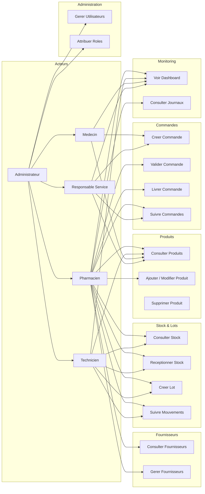
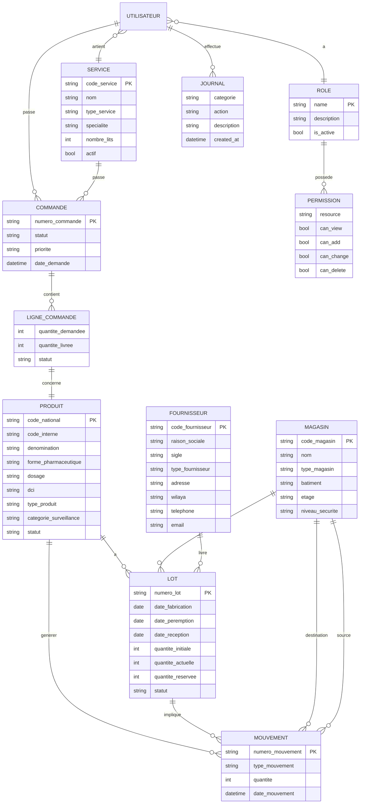
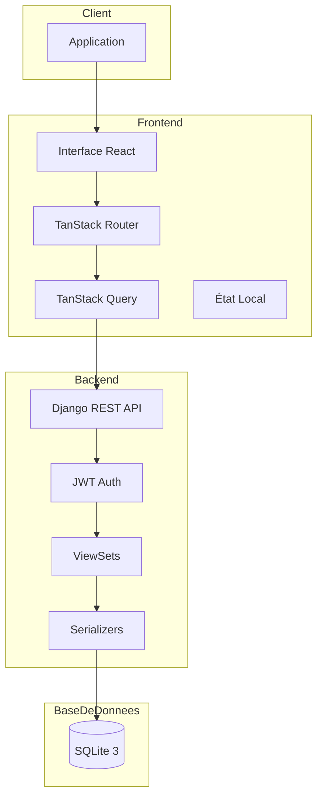
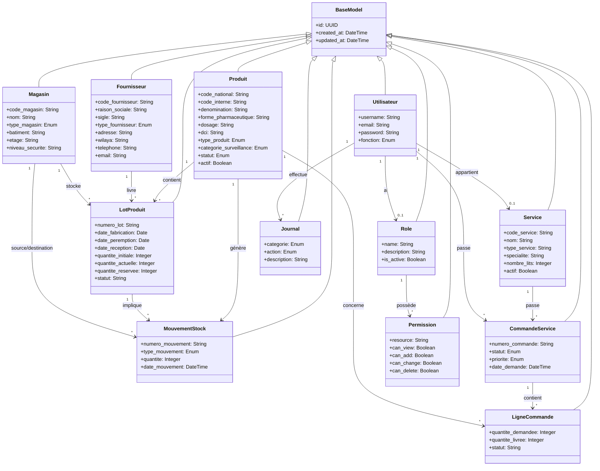
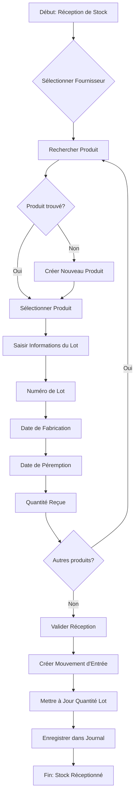
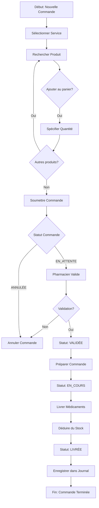
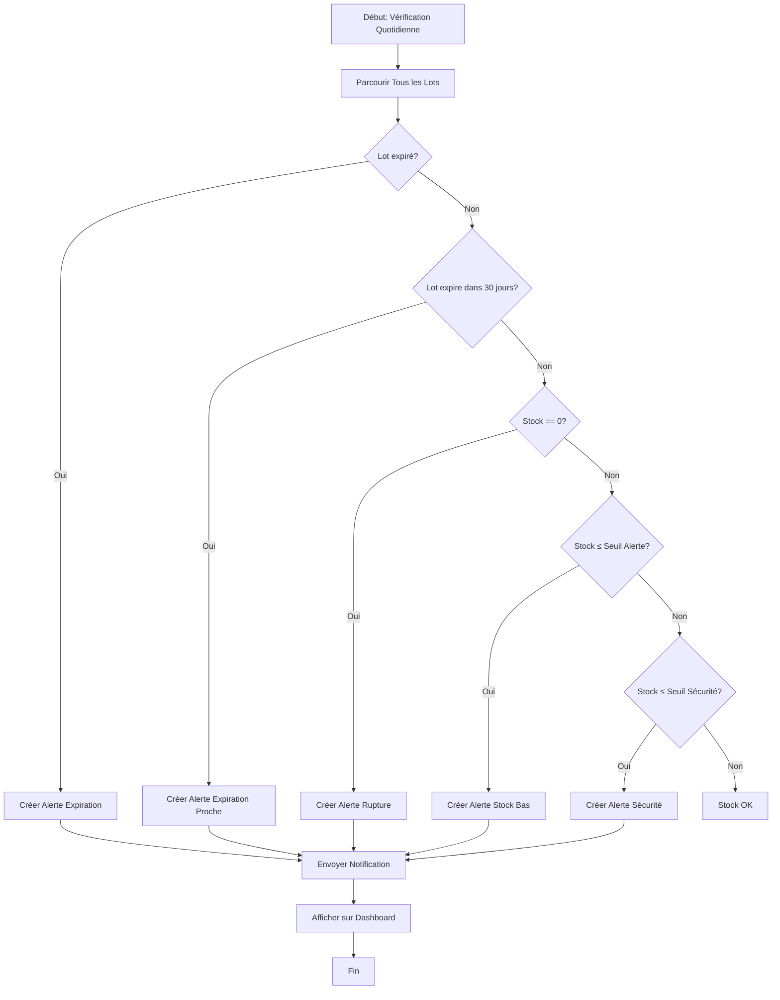

# GDS - Gestion de Dispensation des Stupéfiants

## Système de Gestion de Pharmacie Hospitalière

---

# 1. Diagramme des Cas d'Utilisation (Use Case)



---

## 1.1 Description des Cas d'Utilisation

| Cas                    | Acteur                        | Description                                          |
| ---------------------- | ----------------------------- | ---------------------------------------------------- |
| **Consulter Produits** | Tous                          | Rechercher et afficher la liste des médicaments      |
| **Ajouter Produit**    | Admin, Pharmacien             | Créer un nouveau médicament dans le système          |
| **Modifier Produit**   | Admin, Pharmacien             | Mettre à jour les informations d'un médicament       |
| **Réceptionner Stock** | Admin, Pharmacien, Technicien | Enregistrer une nouvelle livraison de médicaments    |
| **Créer Lot**          | Admin, Pharmacien, Technicien | Créer un lot avec numéro, date péremption, quantité  |
| **Créer Commande**     | Médecin, Responsable          | Soumettre une demande de médicaments pour un service |
| **Valider Commande**   | Pharmacien                    | rouver une demande de médicament                  |
| **Livrer Commande**    | Pharmacien                    | Délivrer les médicaments et déduire du stock         |
| **Voir Dashboard**     | Tous                          | Consulter les KPIs et indicateurs                    |
| **Gérer Utilisateurs** | Administrateur                | Créer, modifier, supprimer des utilisateurs          |
| **Attribuer Rôles**    | Administrateur                | Définir les permissions par rôle                     |

---

# 2. Modèle Conceptuel de Données (MCD)



---

# 3. Modèle Logique de Données (MLD)

```
UTILISATEUR(id, username, password, email, fonction, role_id, service_id)
ROLE(id, name, description, is_active)
PERMISSION(id, role_id, resource, can_view, can_add, can_change, can_delete)
SERVICE(id, code_service, nom, type_service, specialite, nombre_lits, actif)

PRODUIT(id, code_national, code_interne, denomination, denomination_commerciale,
        forme_pharmaceutique, dosage, dci, classe_therapeutique, conditionnement,
        unite_mesure, quantite_par_unite, stock_securite, stock_alerte,
        duree_peremption_mois, temperature_conservation, necessite_chaine_froid,
        type_produit, categorie_surveillance, statut, fabricant, numero_amm, actif)

MAGASIN(id, code_magasin, nom, type_magasin, batiment, etage, niveau_securite, actif)

FOURNISSEUR(id, code_fournisseur, raison_sociale, sigle, type_fournisseur,
            adresse, wilaya, telephone, email, statut)

LOT(id, produit_id, numero_lot, date_fabrication, date_peremption, date_reception,
    quantite_initiale, quantite_actuelle, quantite_reservee, prix_unitaire, statut, magasin_id)

MOUVEMENT(id, numero_mouvement, produit_id, lot_id, type_mouvement, quantite,
          magasin_source_id, magasin_destination_id, date_mouvement)

COMMANDE(id, numero_commande, service_id, utilisateur_id, statut, priorite, date_demande, date_validation, date_livraison)

LIGNE_COMMANDE(id, commande_id, produit_id, quantite_demandee, quantite_livree, statut)

JOURNAL(id, categorie, action, description, utilisateur_id, entity_type, entity_id,
        entity_description, ancien_statut, nouveau_statut, details, created_at)
```

---

# 4. Diagramme d'Architecture Système



---

## 4.1 Architecture Détaillée

```
┌─────────────────────────────────────────────────────────────────┐
│                        CLIENT (Frontend)                        │
│  ┌───────────────────────────────────────────────────────────┐  │
│  │                    Application React                       │  │
│  │  ┌─────────┐  ┌──────────┐  ┌─────────┐  ┌────────────┐  │  │
│  │  │Dashboard│  │Produits  │  │Commandes│  │  Stock     │  │  │
│  │  └────┬────┘  └────┬─────┘  └────┬────┘  └─────┬──────┘  │  │
│  │       └──────────┬┴───────────┬┴───────────┬┘          │  │
│  │                  ▼            ▼            ▼             │  │
│  │            ┌─────────────────────────────────────────┐    │  │
│  │            │         TanStack Query (Cache)         │    │  │
│  │            └─────────────────┬───────────────────────┘    │  │
│  │                              ▼                            │  │
│  │            ┌─────────────────────────────────────────┐    │  │
│  │            │           Data Provider                  │    │  │
│  │            └─────────────────┬───────────────────────┘    │  │
│  └──────────────────────────────┼────────────────────────────┘  │
│                                 │ HTTP + JWT                    │
└─────────────────────────────────┼───────────────────────────────┘
                                  ▼
┌─────────────────────────────────────────────────────────────────┐
│                       SERVEUR (Backend)                         │
│  ┌───────────────────────────────────────────────────────────┐  │
│  │                   Django + DRF                             │  │
│  │  ┌─────────────────────────────────────────────────────┐  │  │
│  │  │                    API Layer                        │  │  │
│  │  │  ┌─────────┐ ┌──────────┐ ┌─────────┐ ┌─────────┐  │  │  │
│  │  │  │Produits │ │  Lots    │ │Commandes│ │  Users  │  │  │  │
│  │  │  │ ViewSet │ │ ViewSet  │ │ ViewSet │ │ ViewSet │  │  │  │
│  │  │  └────┬────┘ └────┬─────┘ └────┬────┘ └────┬────┘  │  │  │
│  │  │       └──────────┬┴───────────┬┴───────────┘       │  │  │
│  │  │                  ▼                                 │  │  │
│  │  │          ┌─────────────────┐                       │  │  │
│  │  │          │  Serializers    │                       │  │  │
│  │  │          └────────┬────────┘                       │  │  │
│  │  └───────────────────┼───────────────────────────────┘  │  │
│  │                      ▼                                   │  │
│  │          ┌───────────────────────┐                      │  │
│  │          │      ORM Django       │                      │  │
│  │          └───────────┬───────────┘                      │  │
│  └──────────────────────┼──────────────────────────────────┘  │
│                         ▼                                       │
│  ┌───────────────────────────────────────────────────────────┐  │
│  │                  Base de Données                         │  │
│  │                   SQLite 3                               │  │
│  └───────────────────────────────────────────────────────────┘  │
└─────────────────────────────────────────────────────────────────┘
```

---

# 5. Diagramme de Classes (UML)



---

# 6. Diagrammes de Flux des Processus

## 6.1 Flux de Réception de Stock



## 6.2 Flux de Commande de Médicaments



## 6.3 Flux d'Alerte de Stock



---

# 7. Tableau Récapitulatif des Entités

| Entité              | Description                      | Attributs Principaux                            |
| ------------------- | -------------------------------- | ----------------------------------------------- |
| **Produit**         | Médicament ou dispositif médical | code_national, denomination, forme, dosage, DCI |
| **LotProduit**      | Lot d'un produit avec expiration | numero_lot, dates, quantités                    |
| **MouvementStock**  | Entrée/Sortie de stock           | type_mouvement, quantité, dates                 |
| **Fournisseur**     | Entreprise pharmaceutique        | raison_sociale, adresse, téléphone              |
| **Service**         | Service hospitalier              | code_service, nom, specialite                   |
| **CommandeService** | Demande de médicaments           | numero_commande, statut, priorite               |
| **LigneCommande**   | Ligne d'une commande             | produit, quantites                              |
| **Magasin**         | Entrepôt/Zone de stockage        | code_magasin, type, securite                    |
| **Utilisateur**     | Utilisateur du système           | username, role, fonction                        |
| **Role**            | Rôle avec permissions            | name, permissions                               |
| **Journal**         | Historique des actions           | categorie, action, description                  |

---

# 8. Stack Technique

| Couche               | Technologie                         |
| -------------------- | ----------------------------------- |
| **Frontend**         | React, TanStack Start, Tailwind CSS |
| **Backend**          | Django 6.0, Django REST Framework   |
| **Base de données**  | SQLite 3 (développement)            |
| **Authentification** | JWT (djangorestframework-simplejwt) |
| **Icons**            | Lucide React                        |
| **State Management** | TanStack Query                      |

---

# 9. Rôles et Permissions

| Rôle            | Permissions                                |
| --------------- | ------------------------------------------ |
| **ADMIN**       | Accès complet à toutes les fonctionnalités |
| **PHARMACIEN**  | Gestion produits, lots, commandes          |
| **TECHNICIEN**  | Vue produits, ajout lots et mouvements     |
| **RESPONSABLE** | Gestion commandes                          |
| **MEDECIN**     | Vue produits, création commandes           |
| **CONSULTANT**  | Lecture seule                              |

---

# 10. Captures d'Écran du Projet

Le projet contient les captures d'écran suivantes dans le dossier `docs/`:

- Dashboard avec KPIs
- Gestion des produits
- Réception de stock
- Commandes en attente
- Journaux d'audit
### 1. Interface d'Authentification

* **Légende :** Portail de Connexion Sécurisé
* **Description :** Point d'entrée unique du système utilisant une authentification par **JWT (JSON Web Token)**. Cette interface permet de filtrer les accès selon les rôles définis (Administrateur, Pharmacien, Médecin, etc.) pour garantir la sécurité des données sensibles.

### 2. Tableau de Bord (Dashboard)

* **Légende :** Pilotage et Indicateurs de Performance (KPIs)
* **Description :** Vue d'ensemble affichant les données critiques : valeur totale du stock, nombre de produits en rupture, et alertes de péremption à 30 jours. Le système utilise des widgets dynamiques pour une aide à la décision immédiate.

### 3. Création de Commande Service

* **Légende :** Interface de Saisie de Commande
* **Description :** Interface intuitive permettant aux médecins ou responsables de service de rechercher des produits par DCI et de les ajouter à un panier virtuel. Un résumé à droite permet de valider les quantités avant la soumission au pharmacien.

### 4. État du Stock et Alertes

* **Légende :** Monitoring de l'Inventaire
* **Description :** Vue synthétique des niveaux de stock par produit. Le système utilise des badges de couleur (ex: "Alerte" en orange) pour signaler visuellement quand un produit atteint son seuil critique de sécurité.

### 5. Catalogue des Produits

* **Légende :** Référentiel National des Médicaments
* **Description :** Base de données centralisée listant les caractéristiques techniques : Code National, DCI, forme pharmaceutique (Gélule, Comprimé, Poudre) et catégorie de surveillance (Normal vs Psychotrope).

### 6. Traçabilité par Lot

* **Légende :** Suivi de la Traçabilité et Péremptions
* **Description :** Détail indispensable pour la pharmacovigilance. Chaque ligne représente un lot spécifique avec son numéro unique, ses dates de fabrication/péremption, et la distinction entre quantité actuelle et quantité réservée.

### 7. Suivi du Flux de Distribution

* **Légende :** Gestion du Cycle de Vie des Commandes
* **Description :** Interface permettant de filtrer les demandes par statut (En attente, Validée, Livrée). C'est ici que le pharmacien approuve les demandes avant la déduction automatique du stock.

### 8. Configuration des Services

* **Légende :** Cartographie des Unités de Soins
* **Description :** Liste des services hospitaliers (Urgences, Réanimation, etc.) rattachés à la pharmacie. Chaque service est paramétré avec sa spécialité et son nombre de lits pour une gestion analytique.

### 9. Réception de Stock (Entrées)

* **Légende :** Module d'Approvisionnement et Entrée de Stock
* **Description :** Interface dédiée à l'enregistrement des nouveaux arrivages. Elle permet de saisir le fournisseur, le numéro de lot et les dates de péremption, assurant que chaque produit entrant est immédiatement traçable dans le système.

### 10. Journal d'Audit (Logs)

* **Légende :** Historique des Actions et Sécurité
* **Description :** Le journal d'audit consigne chaque opération effectuée sur la plateforme (qui, quoi, quand). C'est un outil de conformité crucial pour la gestion des stupéfiants, garantissant qu'aucune modification de stock ou validation de commande ne reste anonyme.
